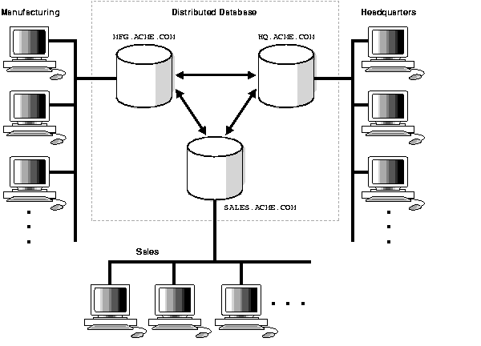

# Les bases de données distribuées

En informatique, une base de données distribuée ou BDD (en anglais : distributed database) est une base de données 
dont la gestion est traitée par un réseau d'ordinateurs interconnectés qui stockent des données de manière distribuée. 
Ce stockage peut être soit partitionné entre différents nœuds du réseau, soit répliqué entièrement sur chacun d'eux, 
ou soit organisé de façon hybride[[1]](#alchemy-docs-1).

Source: https://docs.oracle.com/cd/B10501_01/server.920/a96521/ds_concepts.htm

<a name="sqlalchemy-docs-1">[1]</a>:https://en.wikipedia.org/wiki/Distributed_database
